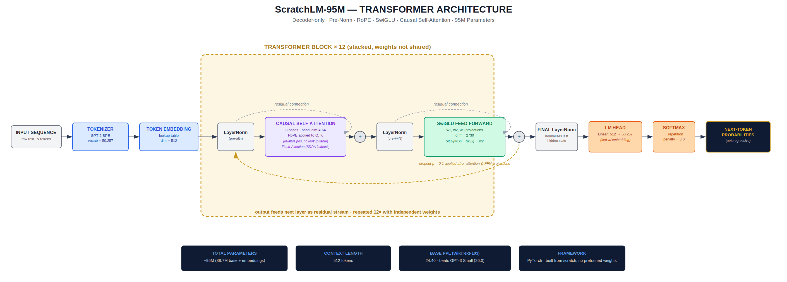
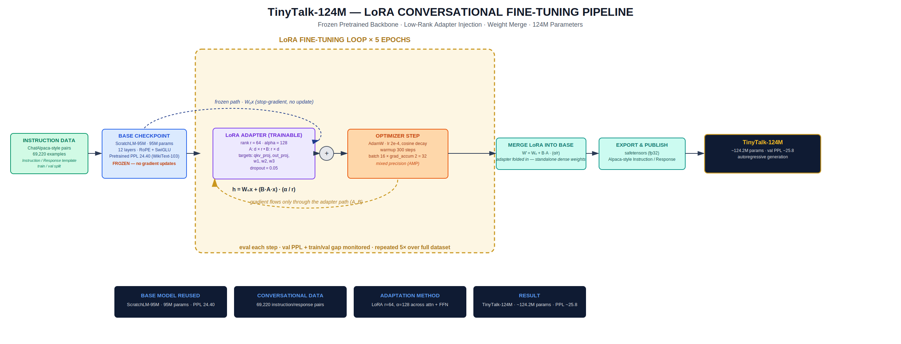

# TinyTalk-124M

### A Conversational Language Model Built Entirely From Scratch

[](https://www.python.org/)
[](https://pytorch.org/)
[](LICENSE)
[](https://huggingface.co/Debarun12)

A from-scratch transformer language model, pretrained on WikiText-103 and fine-tuned into a conversational model using parameter-efficient LoRA adaptation — no pretrained weights, no external model downloads, every component implemented and trained independently.

---

## Overview

This project implements a complete LLM pipeline in two stages:

| Stage | Model | Description |
|---|---|---|
| **1. Pretraining** | `ScratchLM-95M` | A 95M-parameter decoder-only transformer trained from scratch on WikiText-103 |
| **2. Fine-Tuning** | `TinyTalk-124M` | A conversational model built by adapting ScratchLM-95M with staged LoRA fine-tuning |

The goal was to design and train a language model end-to-end — architecture, pretraining loop, and instruction-tuning pipeline — using modern design choices found in production LLMs (RoPE, SwiGLU, LoRA) implemented from first principles rather than imported from existing libraries.

---


## Architecture

<p align="center">
  
</p>

**ScratchLM-95M** is a 12-layer, decoder-only transformer using:

- **RoPE (Rotary Positional Embeddings)** — relative position encoding, no learned position table
- **SwiGLU activation** in the feed-forward block (as used in LLaMA, Mistral, and Gemma)
- **Causal self-attention** with Flash Attention (SDPA fallback for compatibility)
- **Pre-Norm** transformer blocks with residual connections
- **GPT-2 BPE tokenizer** (50,257 vocabulary)

| Parameter | Value |
|---|---|
| Total Parameters | ~95M (88.7M base + embeddings) |
| Layers | 12 |
| Embedding Dimension | 512 |
| Attention Heads | 8 (head_dim = 64) |
| FFN Intermediate Dim | 2,730 |
| Context Length | 512 tokens |
| Base Perplexity (WikiText-103) | **24.40** — outperforming GPT-3 Small (26.0) at ~70% of the parameter count |

---

## Fine-Tuning Pipeline

<p align="center">
  
</p>

**TinyTalk-124M** is produced by adapting the frozen ScratchLM-95M backbone using **LoRA (Low-Rank Adaptation)**:

- Base model weights remain frozen throughout fine-tuning
- Trainable low-rank matrices (rank = 64, alpha = 128) injected into attention (`qkv_proj`, `out_proj`) and feed-forward (`w1`, `w2`, `w3`) projections
- Adapter weights merged directly into the base after convergence: `W' = W₀ + B·A · (α/r)`
- Fine-tuned on 69,220 instruction/response conversational pairs (ChatAlpaca-style format)
- Trained with AdamW, cosine learning rate decay, and mixed precision (AMP) on a single consumer GPU

| Metric | Value |
|---|---|
| Total Parameters | ~124.2M |
| Adaptation Method | LoRA (r=64, α=128) |
| Fine-Tuning Data | 69,220 instruction/response pairs |
| Validation Perplexity | ~25.8 |
| Training Epochs | 5 |

---

## Project Structure

```
tinytalk-124m/
├── model/
│   ├── transformer.py        # Core decoder-only transformer (RoPE, SwiGLU, attention)
│   ├── lora.py                # LoRA adapter implementation
│   └── config.py              # Model + training hyperparameters
├── training/
│   ├── pretrain.py             # WikiText-103 pretraining loop
│   ├── finetune_lora.py       # LoRA fine-tuning pipeline
│   └── merge_weights.py       # Adapter merge utility
├── data/
│   ├── prepare_wikitext.py
│   └── prepare_conversational.py
├── inference/
│   └── generate.py             # Autoregressive text generation with repetition penalty
├── assets/
│   ├── ScratchLM-95M_architecture.png
│   └── TinyTalk-124M_LoRA_pipeline.png
├── requirements.txt
└── README.md
```

---

## Installation

```bash
git clone https://github.com/Debarun12/tinytalk-124m.git
cd tinytalk-124m
pip install -r requirements.txt
```

**Requirements:** Python 3.10+, PyTorch 2.x, a CUDA-capable GPU recommended for training (inference runs on CPU).

---

## Usage

### Load and run inference

```python
from model.transformer import ScratchLM
from inference.generate import generate_text

model = ScratchLM.from_checkpoint("checkpoints/tinytalk-124m.pt")

response = generate_text(
    model,
    prompt="What is the capital of France?",
    max_new_tokens=80,
    repetition_penalty=3.0
)
print(response)
```

### Pretrain the base model

```bash
python training/pretrain.py --config configs/pretrain.yaml
```

### Fine-tune with LoRA

```bash
python training/finetune_lora.py --base_checkpoint checkpoints/scratchlm-95m.pt --config configs/lora.yaml
```

### Merge LoRA adapter into base weights

```bash
python training/merge_weights.py --base checkpoints/scratchlm-95m.pt --adapter checkpoints/lora_adapter.pt --out checkpoints/tinytalk-124m.pt
```

---

## Results Summary

| Model | Parameters | Task | Perplexity |
|---|---|---|---|
| ScratchLM-95M | 95M | Language Modeling (WikiText-103) | 24.40 |
| TinyTalk-124M | 124.2M | Conversational Fine-Tuning | ~25.8 |

Both models were trained entirely on a single consumer GPU, demonstrating that competitive language modeling and conversational fine-tuning results are achievable without large-scale compute infrastructure.

---

## Key Engineering Highlights

- Full transformer architecture (RoPE, SwiGLU, causal attention) implemented from scratch in PyTorch
- Modern training practices: gradient accumulation, cosine LR scheduling, gradient clipping, mixed precision
- Parameter-efficient fine-tuning via a custom LoRA implementation, avoiding full-model retraining
- Weight-merge deployment strategy producing standalone, dependency-free checkpoints
- End-to-end pipeline: raw corpus → pretrained backbone → conversational fine-tuned model

---

## Model Checkpoints

Pretrained and fine-tuned checkpoints are available on Hugging Face:
**[huggingface.co/Debarun12](https://huggingface.co/Debarun12)**

---

## Author

**Debarun Das**
[GitHub](https://github.com/Debarun12) · [Hugging Face](https://huggingface.co/Debarun12)

---

## License

This project is released under the MIT License. See [LICENSE](LICENSE) for details.
